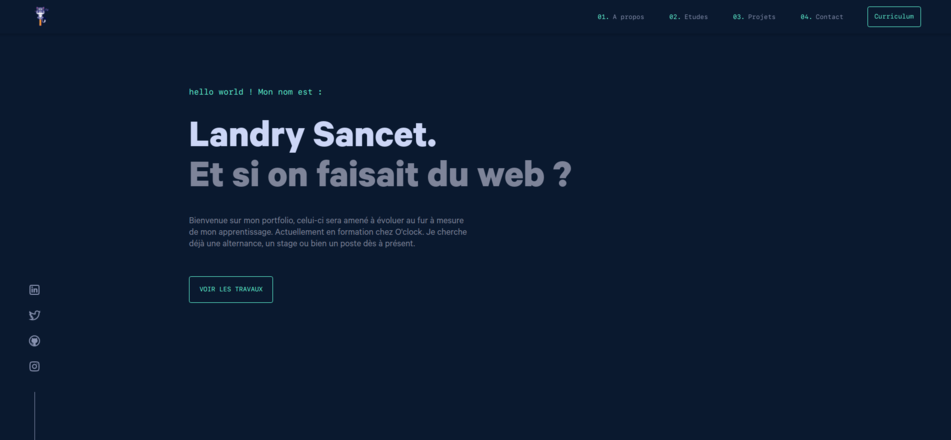

# Bienvenue sur mon Portfolio !

Hello, je suis Landry et si tu est ici, c'est que tu voulais en savoir plus sur mon Portfolio. Ici, tu trouveras tout le code que j'ai utilisé, produit, les logiques, quelques commentaires et surtout, tu pourras voir mon travail. N'hésitez pas à proposer des améliorations, je suis à l'écoute ! 

  
Spoiler warning

  
  

## 🛠️  Installation & Set Up

Cloner le repository à l'aide de la clé SSH disponible au dessus. 
Se placer dans le dossier "application" à l'aide du terminal, puis faire : 

    NPM INSTALL
dans le terminal. 

## 🔎  Language 

Tout ce projet a été réalisé en : 

- Javascript
- Node.js

Avec EJS, Express et Dotenv. 

## 🎨 Color Reference

| Couleur | HEX |
|--|--|
| Navy | `#0a192f` |
| Light Navy | `#112240` |
| Lightest Navy | `#233554` |
| Slate | `#8892b0` |
| Light Slate | `#a8b2d1` |
| Lightest Slate | `#ccd6f6` |
| White | `#e6f1ff` |
| Green | `#64ffda` |

